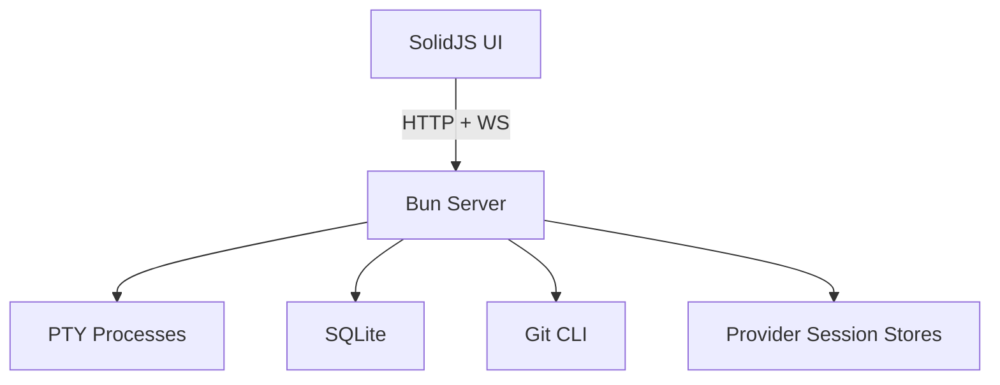

# bord

<p align="center">
  
</p>

A workspace-scoped terminal manager with tiling layout, git/diff workflow, docker controls, and multi-provider session resume.


## Install

### macOS (Homebrew)

```bash
brew install --cask wilky-way/tap/bord
```

### macOS (manual)

Download the `.dmg` from the [latest release](https://github.com/wilky-way/bord/releases/latest) (`aarch64` for Apple Silicon, `x64` for Intel).

### Windows / Linux

Download from [latest release](https://github.com/wilky-way/bord/releases/latest):
- Windows: `.msi` / `.exe`
- Linux: `.deb` / `.rpm`

## Quickstart (Dev)

```bash
bun install
bun run dev
# UI: http://localhost:1420
# API/WS: http://localhost:4200
```

## Demo


[Full workflow video (WebM)](./docs/media/showcase-workflow.webm)  
[Full screenshot gallery](./docs/media/gallery.md)

## Core Capabilities

- Workspace ownership for terminals (active + stashed per workspace)
- 1x/2x/3x/4x layout density, minimap navigation, drag reorder, panel resize
- Session resume for Claude, Codex, OpenCode (Gemini UI present, scanner parity pending)
- In-card git workflow (status, diff, stage/unstage, commit, push/pull, branch ops)
- Docker compose discovery and service controls in sidebar
- Built-in file tree + viewer + markdown preview
- Built-in icon packs: Bord Classic, Catppuccin, Material Icon Theme, vscode-icons
- Theme system with synchronized app chrome + terminal ANSI palettes

## Architecture (High Level)

- Tauri v2 desktop shell hosts a SolidJS web UI.
- Bun server handles PTY lifecycle, routes, and WebSocket streaming.
- `ghostty-web` renders terminals in the client.
- SQLite stores workspaces/session cache/app state.



Detailed architecture: [`docs/architecture.md`](./docs/architecture.md)

## Docs Map

| Topic | Doc |
|---|---|
| Product usage | [`docs/how-to/using-bord.md`](./docs/how-to/using-bord.md) |
| Terminal internals primer | [`docs/how-to/terminal-ecosystem-primer.md`](./docs/how-to/terminal-ecosystem-primer.md) |
| Architecture deep dive | [`docs/architecture.md`](./docs/architecture.md) |
| Media gallery | [`docs/media/gallery.md`](./docs/media/gallery.md) |
| Keyboard shortcuts | [`docs/reference/shortcuts.md`](./docs/reference/shortcuts.md) |
| Testing index | [`docs/testing/README.md`](./docs/testing/README.md) |
| Fixture lab setup | [`docs/how-to/fixture-lab.md`](./docs/how-to/fixture-lab.md) |
| Release process | [`docs/how-to/releasing.md`](./docs/how-to/releasing.md) |
| Execution plan | [`docs/plan.md`](./docs/plan.md) |
| Roadmap | [`ROADMAP.md`](./ROADMAP.md) |

## Media and Fixture Automation

```bash
bun run fixtures:setup
bun run fixtures:register
bun run qa:capture-media
```

Capture profiles (via env var):
- `BORD_CAPTURE_MODE=mixed` (default)
- `BORD_CAPTURE_MODE=context`
- `BORD_CAPTURE_MODE=closeup`

## Bundled Icon Licenses

- Catppuccin: `public/vendor/catppuccin-icons/LICENSE`
- Material Icon Theme: `public/vendor/material-icons/LICENSE`
- vscode-icons: `public/vendor/vscode-icons/LICENSE`

## Support

[Buy me a coffee](https://buymeacoffee.com/wilkyway90e)

## License

Private - not yet published under an open-source license.
