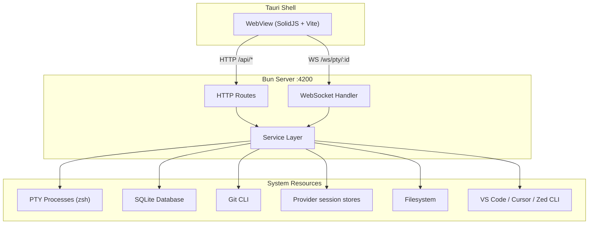
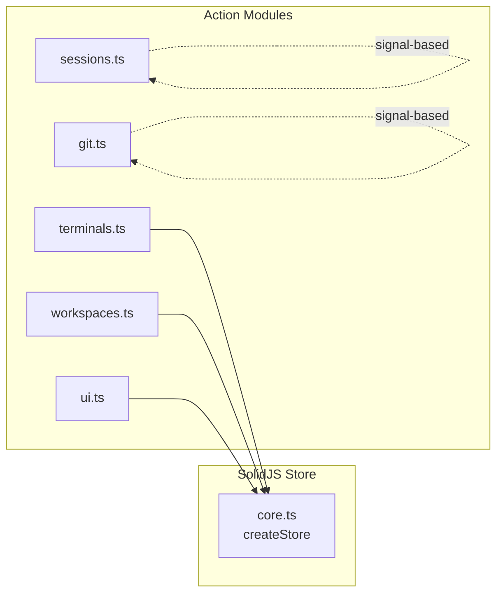
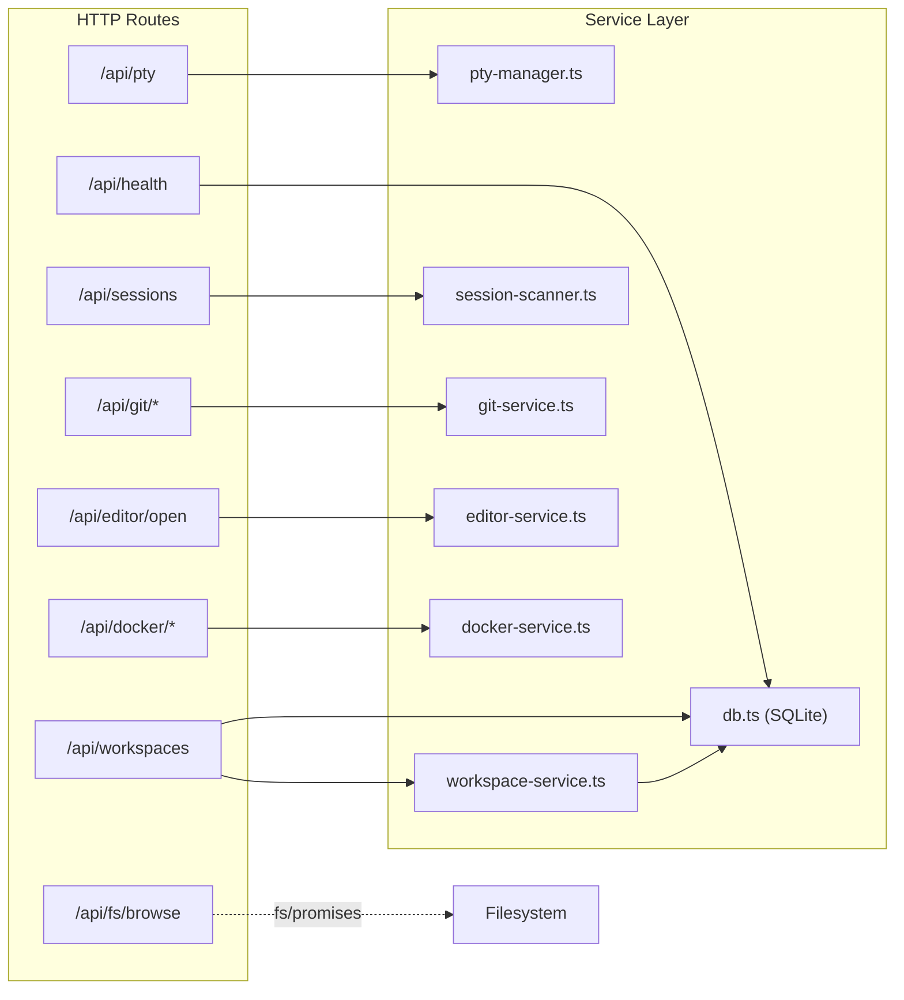
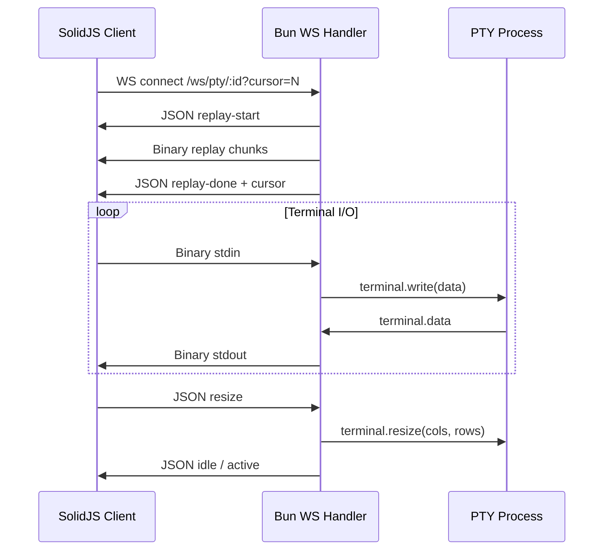
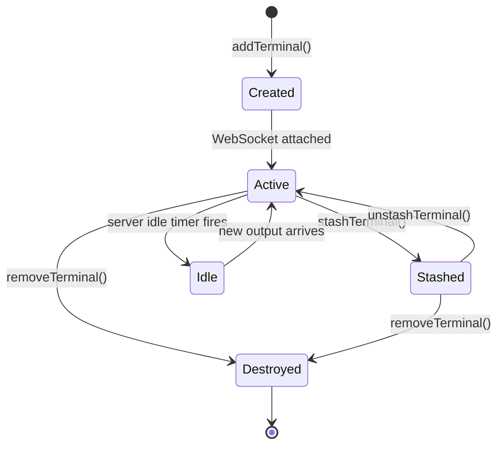

# Architecture Overview

This is the technical architecture reference for Bord.

If you are new to terminal internals, start with the [Terminal Ecosystem Primer](./how-to/terminal-ecosystem-primer.md).

## Stack Decisions

| Choice | Over | Why |
|--------|------|-----|
| [ghostty-web](https://github.com/coder/ghostty-web) | xterm.js | Ghostty parser fidelity in WASM with xterm-like API compatibility. |
| Bun server/runtime | Node.js | Native PTY support via `Bun.spawn({ terminal })`, built-in SQLite, native WS in `Bun.serve()`. |
| SolidJS | React | Fine-grained updates help when many terminals stream output concurrently. |
| Tauri v2 shell | Electron | Lower idle memory footprint and faster startup with system WebView. |

## System Architecture



## Client State Model

- Core app state uses Solid `createStore` in `src/store/core.ts`.
- Async loaded slices (sessions/git) use dedicated signals for reactive decoupling.
- Terminal actions are mutation helpers in `src/store/terminals.ts`.



## Server Routes and Services



## PTY WebSocket Flow



## Terminal Lifecycle



## Repository Structure

```text
bord/
├── server/              # Bun server: routes, services, ws protocol/handler
├── src/                 # SolidJS app: components, store, lib utilities
├── src-tauri/           # Tauri v2 shell configuration + Rust host
├── scripts/             # fixture setup and QA media capture scripts
├── docs/                # operator/testing/architecture/media documentation
└── e2e/                 # Playwright coverage
```
