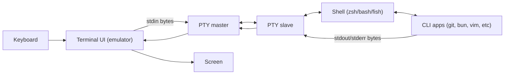
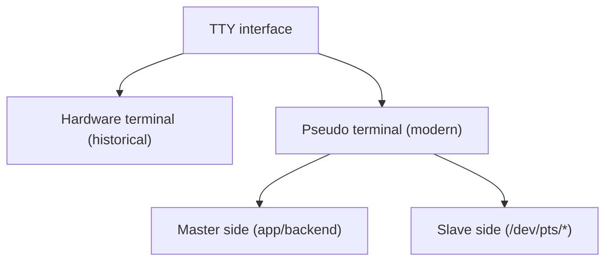
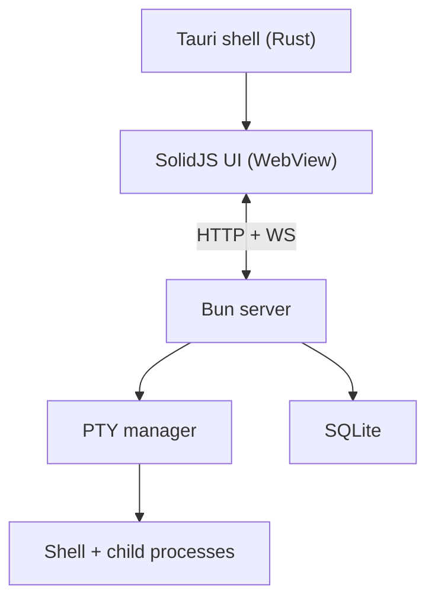
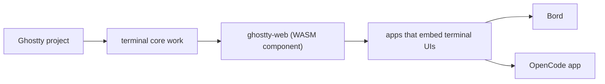
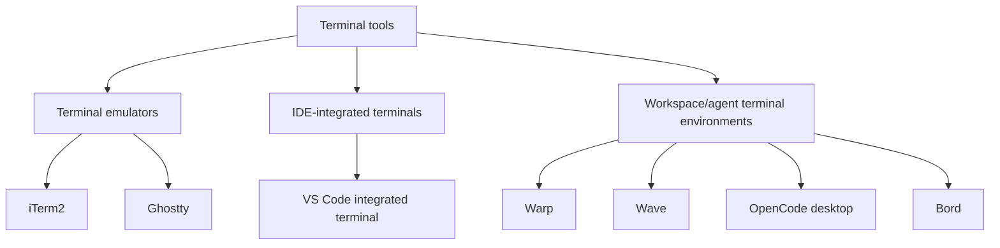

# Terminal Ecosystem Primer

This document is a plain-language guide to how terminals work and how Bord compares to tools like iTerm2, Ghostty, Warp, Wave, VS Code, and OpenCode.

If you only remember one thing: a terminal UI is not the shell. The UI renders text and sends bytes. The shell runs inside a PTY.

## The Big Picture

## Core Terms (TTY, PTY, Shell, Emulator)

| Term | What it means | Why it matters |
| --- | --- | --- |
| Terminal emulator | App component that draws terminal output and interprets control sequences | This is what users look at |
| Shell | Command interpreter (`zsh`, `bash`, `fish`) | This executes commands |
| TTY | Unix terminal interface model (historically physical terminals) | Programs still target this model |
| PTY | Pseudo-terminal: software TTY pair (`master` + `slave`) | Modern terminal apps use this |
| PTY master | Side owned by terminal backend | Bord writes to and reads from this side |
| PTY slave | Side presented to shell/process | Shell believes it is a real terminal |

### TTY vs PTY

TTY is the interface concept. PTY is the software implementation of that concept.

## What Bord Is

Bord is a workspace-scoped terminal manager with strict ownership rules:

- Every terminal has a required `workspaceId`.
- No active workspace means no new terminal.
- Terminals can be stashed without killing the PTY.
- Session linkage is optional metadata (`sessionId`, `provider`), not required for terminal existence.

This keeps the model deterministic: no orphan terminals and no ambiguous ownership.

## Bord Architecture

Why this is a valid architecture:

- Tauri gives native desktop packaging with a lightweight webview shell.
- Bun handles PTY lifecycle, WebSocket I/O fan-out, and API endpoints.
- SolidJS gives responsive multi-pane UI updates.
- `ghostty-web` provides high-fidelity terminal emulation in the client.

## Ghostty vs ghostty-web

These are related but not the same thing.

- Ghostty: standalone terminal emulator app.
- ghostty-web: embeddable web/WASM terminal emulation component based on Ghostty terminal work.

## Product Differences: What Category Is Each Tool?

| Tool | Primary identity | Platform/runtime notes |
| --- | --- | --- |
| iTerm2 | macOS terminal emulator replacement | Native macOS app, long-lived mature project |
| Ghostty | Fast, standards-focused terminal emulator | Native app stack, open source, cross-platform focus |
| VS Code integrated terminal | IDE terminal inside editor workflows | Electron app; terminal renderer is xterm.js |
| Warp | Agentic terminal environment | Rust-based modern terminal UX; public repo is primarily issues/templates |
| Wave Terminal | Open-source terminal workspace app | Public repo shows Electron + Go + TypeScript stack |
| OpenCode desktop | Agent/client terminal environment | Tauri desktop package + client/server model; app package uses `ghostty-web` |
| Bord | Workspace-owned terminal manager | Tauri + SolidJS + Bun + `ghostty-web` |

## Why Bord Is Not "Just Another Terminal"

- It enforces workspace ownership at the data model level.
- It treats terminal sessions as managed objects with lifecycle events (active, stashed, removed).
- It couples terminal workflows with workspace-aware sessions, git operations, and notifications.

That makes Bord closer to a terminal orchestration surface than a plain terminal tab app.

## Quick FAQ

### Is PTY "real" terminal behavior?

Yes. PTY is the normal way software terminals work on Unix-like systems.

### Is using Tauri + Bun + web UI weird?

No. It is a practical split: native shell/container + web UI + process backend.

### Is Ghostty/ghostty-web reputable?

Yes. Ghostty is widely adopted in terminal circles and `ghostty-web` is used in real products that embed terminals.

## Testing Mindset for Bord

If you are writing tests for terminal management, prioritize these invariants:

1. New terminals cannot be created without an active workspace.
2. Every terminal must always have a `workspaceId`.
3. Stashing must not destroy the PTY process.
4. Visibility filtering must obey both workspace and stash state.
5. Removing a terminal must clean up PTY resources and notification state.

If these hold, the architecture remains predictable.
