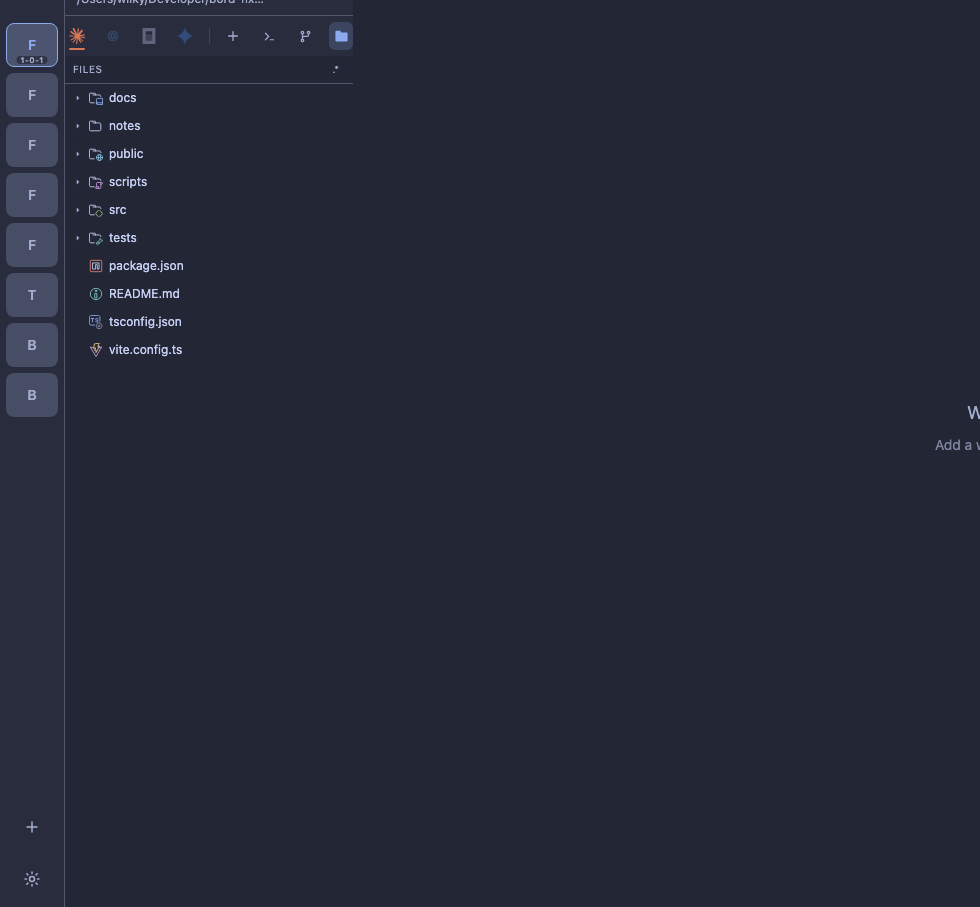
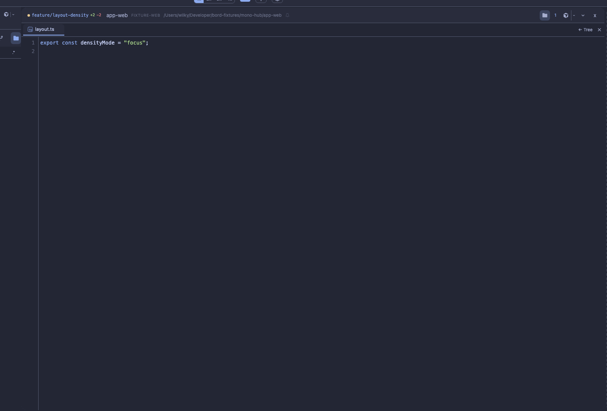
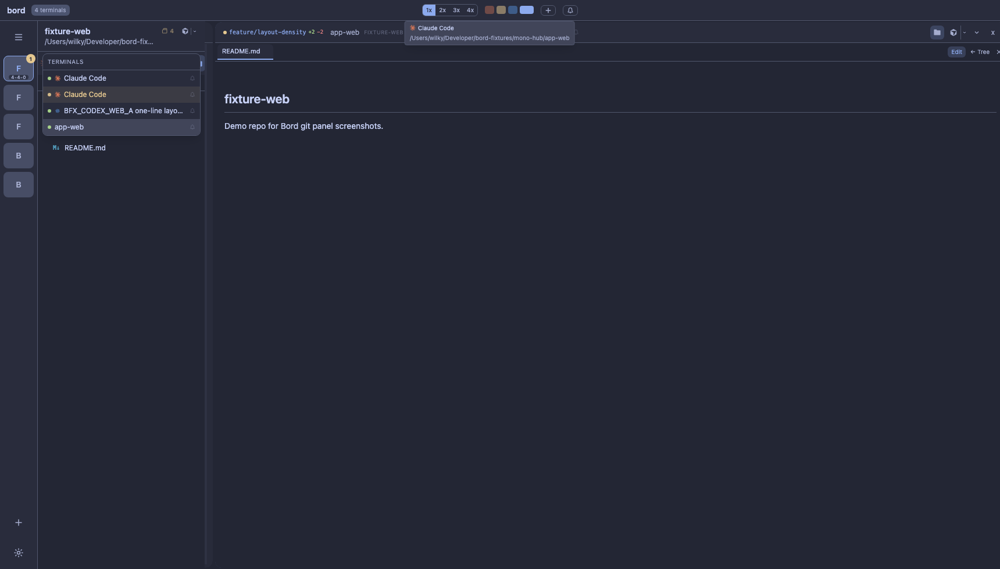
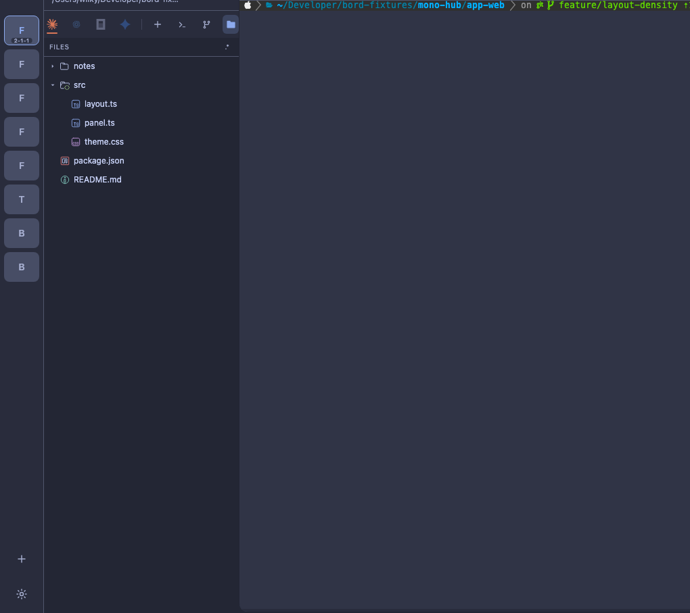
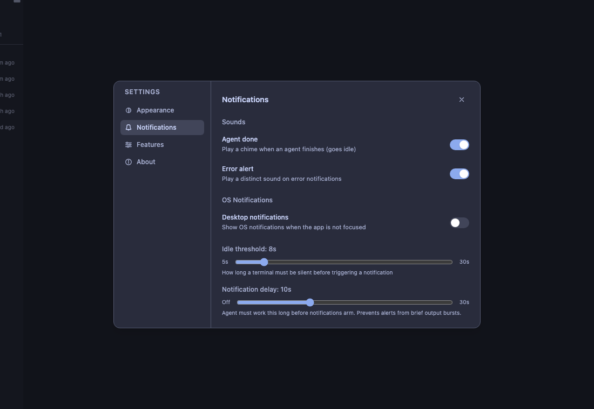
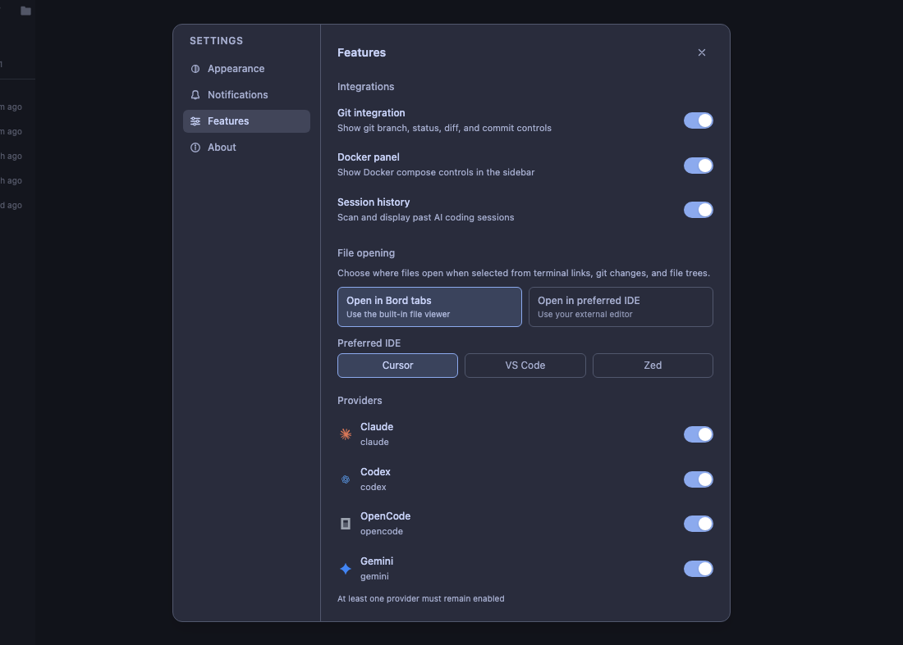
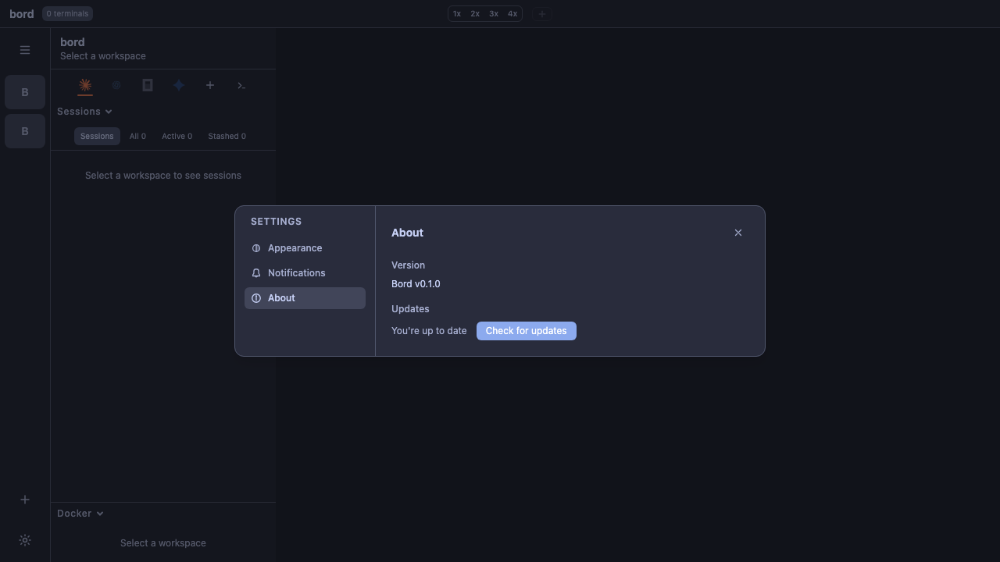

# Media Gallery

This gallery is generated from fixture automation (`bun run qa:capture-media`).

## Core Workflow

[Full workflow video (WebM)](./showcase-workflow.webm)

## Sessions and Terminal Layout

## Navigation, Minimap, and Stash

## Git and Docker

## Files and Editor Integration

## Settings

## Theme Samples

